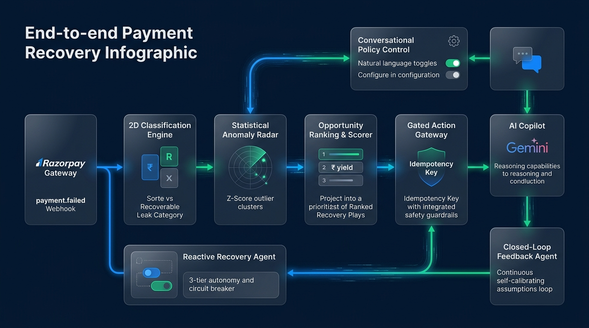
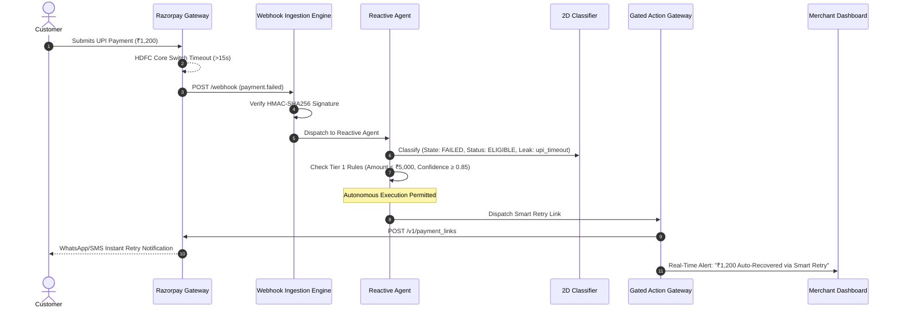
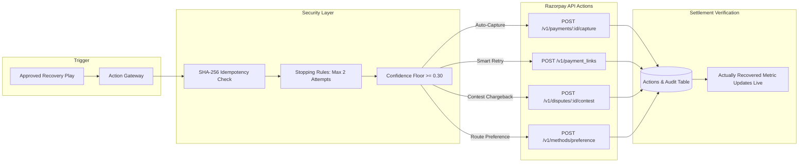

# RazorRecover — Architecture Blueprint & Engineering Story

> *"Dashboards tell you what broke yesterday. RazorRecover actually brings the money back today."*

---

## 1. Why We Built This: The Payment Dashboard Lie

If you run an online business on Razorpay, your dashboard displays a comforting number: **"82.4% Success Rate"**. 

It feels decent until you realize what that remaining 17.6% means in hard cash:
- Thousands of rupees vanish into transient bank timeouts.
- Authorized card payments silently expire uncaptured.
- Customers get spooked by false-positive fraud declines and never come back.

When we looked at how merchants currently solve this, the reality was painful. Operations teams sit with spreadsheets, digging through cryptic error strings like `GATEWAY_ERROR` or `BAD_REQUEST_ERROR`. They have no idea if that failure was a real customer giving up or an HDFC UPI server choking for 90 seconds. And even when they spot a pattern, there’s no button to fix it.

```
┌────────────────────────────────────────┐
│           ONLINE MERCHANT              │
│       "Where did my ₹4.2 Lakh go?"     │
└───────────────────┬────────────────────┘
                    │ Real-Time Decision Support & Instant Execution
                    ▼
┌────────────────────────────────────────────────────────────────────────┐
│                   RAZORRECOVER INTELLIGENCE LAYER                      │
│                                                                        │
│   • 2D Classification Engine (Separates 'Failed' from 'Actionable')    │
│   • Z-Score Anomaly Radar (Spots bank drops before you lose revenue)   │
│   • Deterministic Scorer & 4-Week Forecaster (Exact ₹ projections)     │
│   • Opportunity Ranking Matrix (Prioritizes highest ₹ yield plays)     │
│   • Grounded AI Copilot (Gemini 3.6 Flash grounded strictly in data)   │
│   • Conversational Policy Control (Control automation via chat)        │
│   • Reactive Recovery Agent (3-Tier autonomous execution in seconds)   │
│   • Closed-Loop Feedback Agent (Auto-calibrates assumptions over time) │
│   • Gated Action Gateway (Idempotent, bounded API execution)          │
└─────────────▲────────────────────────────────────────────┬─────────────┘
              │                                            │
   Live Webhook Events                        Targeted REST API Actions
 (payment.failed, dispute.created)           (Capture, Smart Retry, Contest)
              │                                            │
┌─────────────┴────────────────────────────────────────────▼─────────────┐
│                    RAZORPAY PAYMENT GATEWAY INFRA                      │
│            (Core Settlement Rails, Payment Links, API Suite)           │
└────────────────────────────────────────────────────────────────────────┘
```



We built **RazorRecover** as an intelligent shock absorber between your storefront and Razorpay. It intercepts transaction events, pinpoints statistically abnormal money leaks, calculates exactly how many rupees you can win back, and triggers bounded, safe recovery actions before the money is lost forever.

---

## 2. Native Razorpay Parity: Zero-ETL Philosophy

We didn't want merchants to write complex ETL pipelines, translate custom schemas, or manage synchronization lag. 

From day one, our internal data models maintain **exact 1:1 schema parity** with Razorpay's native API objects:

```sql
-- Mirrors Razorpay Payment Entity (/v1/payments)
CREATE TABLE payments (
    id VARCHAR PRIMARY KEY,                  -- pay_... (Razorpay Payment ID)
    order_id VARCHAR NOT NULL,              -- order_... (Razorpay Order ID)
    amount NUMERIC(12, 2) NOT NULL,         -- Value in INR
    currency VARCHAR(3) DEFAULT 'INR',      -- ISO Currency Code
    status VARCHAR NOT NULL,                -- created | authorized | captured | refunded | failed
    captured BOOLEAN NOT NULL,              -- Boolean capture flag
    method VARCHAR NOT NULL,                -- card | upi | netbanking | wallet | emi
    bank VARCHAR,                           -- HDFC | ICICI | SBI | AXIS | etc.
    error_code VARCHAR,                     -- Gateway error code
    error_description VARCHAR,              -- Human-readable message
    error_source VARCHAR,                   -- customer | gateway | bank | business
    error_step VARCHAR,                     -- payment_authorization | payment_processing
    error_reason VARCHAR,                   -- upi_timeout | card_declined_risk | etc.
    created_at TIMESTAMP WITH TIME ZONE DEFAULT CURRENT_TIMESTAMP
);

-- Mirrors Razorpay Order Entity (/v1/orders)
CREATE TABLE orders (
    id VARCHAR PRIMARY KEY,                  -- order_... (Razorpay Order ID)
    amount NUMERIC(12, 2) NOT NULL,         -- Order amount in INR
    amount_paid NUMERIC(12, 2) NOT NULL,    -- Captured amount
    amount_due NUMERIC(12, 2) NOT NULL,     -- Outstanding balance
    currency VARCHAR(3) DEFAULT 'INR',      -- Currency
    receipt VARCHAR,                        -- Merchant receipt reference
    status VARCHAR NOT NULL,                -- created | attempted | paid
    attempts INTEGER DEFAULT 0,             -- Attempt counter
    created_at TIMESTAMP WITH TIME ZONE DEFAULT CURRENT_TIMESTAMP
);

-- Mirrors Razorpay Dispute Entity (/v1/disputes)
CREATE TABLE disputes (
    id VARCHAR PRIMARY KEY,                  -- disp_... (Razorpay Dispute ID)
    payment_id VARCHAR NOT NULL,            -- Associated payment ID
    amount NUMERIC(12, 2) NOT NULL,         -- Disputed amount
    currency VARCHAR(3) DEFAULT 'INR',      -- Currency
    reason_code VARCHAR NOT NULL,           -- fraudulent | product_not_received | etc.
    status VARCHAR NOT NULL,                -- open | under_review | won | lost
    phase VARCHAR NOT NULL,                 -- inquiry | chargeback | pre_arbitration
    respond_by TIMESTAMP WITH TIME ZONE,    -- Hard legal submission deadline
    created_at TIMESTAMP WITH TIME ZONE DEFAULT CURRENT_TIMESTAMP
);

-- Mirrors Razorpay Settlement Entity (/v1/settlements)
CREATE TABLE settlements (
    id VARCHAR PRIMARY KEY,                  -- setl_... (Razorpay Settlement ID)
    payment_id VARCHAR NOT NULL,            -- Reconciled payment ID
    amount NUMERIC(12, 2) NOT NULL,         -- Net payout amount
    fees NUMERIC(12, 2) NOT NULL,           -- Gateway fees
    tax NUMERIC(12, 2) NOT NULL,            -- GST on fee
    utr VARCHAR NOT NULL,                   -- Bank Universal Transaction Reference
    status VARCHAR NOT NULL,                -- created | processed | failed
    created_at TIMESTAMP WITH TIME ZONE DEFAULT CURRENT_TIMESTAMP
);
```

Because our tables match Razorpay's API responses field-for-field, ingesting webhooks or replaying payment CSVs requires **zero field re-mapping**. What Razorpay emits is what we process.

---

## 3. Real-Time Webhook Architecture

RazorRecover isn't just an overnight batch report. It listens live to Razorpay webhook streams:



### The Webhook Events We Listen To

| Event Name | What It Really Means | What RazorRecover Does |
| :--- | :--- | :--- |
| `payment.failed` | The customer's payment didn't go through. | Parses root cause (`error_source`, `error_step`, `error_reason`). If transient (UPI timeout or gateway blip), queues an immediate smart retry. |
| `payment.authorized` | Customer entered OTP, but money wasn't captured. | Starts an auth-expiry watchdog. If 5-day deadline approaches, flags it for instant auto-capture before auto-refund kicks in. |
| `payment.captured` | Payment settled successfully. | Closes open recovery loops, reconciles actual rupees recovered, and feeds back into the forecasting models. |
| `dispute.created` | Customer filed a chargeback with their bank. | Starts a legal defense countdown timer. Scrapes transaction logs to assemble a proof packet before the `respond_by` cutoff. |
| `settlement.processed` | Razorpay transferred payout to your bank. | Verifies the UTR against merchant settlement schedules; highlights banks holding onto funds past T+2 SLAs. |

---

## 4. The 2D Classification Model: Why State ≠ Actionability

One of our biggest engineering breakthroughs was ditching the single `status` column. 

Traditional payment tables say `status: "failed"`. But a failure where the customer typed an invalid UPI ID is completely different from a failure where HDFC's server timed out:
- **Case A (Invalid VPA)**: Customer made a typo. You cannot auto-retry this. It's unrecoverable.
- **Case B (UPI Timeout)**: The customer has the money, the cart is abandoned, and the bank switch hiccuped. A smart retry via SMS/WhatsApp within 2 minutes recovers this **over 60% of the time**.

We split every transaction into two orthogonal dimensions:

```
                        RECOVERY STATUS
                 ELIGIBLE              NOT_ELIGIBLE        NOT_APPLICABLE
          ┌──────────────────────┬──────────────────────┬──────────────────────┐
          │ UPI_TIMEOUT          │ USER_ABANDONED       │                      │
 FAILED   │ GATEWAY_ERROR        │ INSUFFICIENT_FUNDS   │       (Invalid)      │
          │ CARD_DECLINE_RISK    │ INVALID_VPA          │                      │
          ├──────────────────────┼──────────────────────┼──────────────────────┤
AUTHORIZ. │ UNCAPTURED_AUTH      │ EXPIRED_AUTH         │       (Invalid)      │
          ├──────────────────────┼──────────────────────┼──────────────────────┤
DISPUTED  │ CONTESTABLE_CHARGE   │ EXPIRED_DISPUTE      │       (Invalid)      │
          ├──────────────────────┼──────────────────────┼──────────────────────┤
 SETTLED  │ DELAYED_UTR_HOLD     │                      │ HEALTHY_SETTLEMENT   │
          └──────────────────────┴──────────────────────┴──────────────────────┘
```

### How the Logic Decides (100% Deterministic, Zero AI Guesswork)

```python
def classify_payment(payment: Payment) -> tuple[str, str, str]:
    # 1. Terminal user failures -> Drop from recovery pool
    if payment.error_reason in ["user_cancelled", "insufficient_funds", "invalid_vpa"]:
        return ("FAILED", "NOT_ELIGIBLE", "user_abandoned")

    # 2. Transient gateway / bank blips -> High priority recovery
    if payment.error_reason == "upi_timeout":
        return ("FAILED", "ELIGIBLE", "upi_timeout")
    if payment.error_reason == "card_declined_risk":
        return ("FAILED", "ELIGIBLE", "card_decline")
    if payment.error_reason in ["gateway_error", "server_error", "gateway_timeout"]:
        return ("FAILED", "ELIGIBLE", "gateway_error")

    # 3. Uncaptured money sitting in limbo
    if payment.status == "authorized" and not payment.captured:
        return ("AUTHORIZED", "ELIGIBLE", "uncaptured")

    # 4. Disputes with active defense windows
    if payment.has_dispute and payment.dispute_respond_by > now():
        return ("DISPUTED", "ELIGIBLE", "dispute")

    # 5. Normal settled payment -> Healthy
    return ("SETTLED", "NOT_APPLICABLE", None)
```

By decoupling state from recoverability, our dashboard never inflates "Revenue at Risk" with money you can never get back.

---

## 5. Statistical Detection & Grounded Financial Math

We don’t use machine learning buzzwords to hallucinate revenue. Every number on the screen is grounded in classical statistical process control and transparent financial formulas.

### 1. Rolling Z-Score Anomaly Radar
We group transactions into granular buckets:
$$\text{Segment} = \text{Payment Method} \times \text{Bank} \times \text{Error Step}$$

For each segment over a 7-day rolling window:
$$Z = \frac{R_t - \mu}{\sigma}$$

- $R_t$: Current failure rate for that segment.
- $\mu$: 7-day historical mean failure rate.
- $\sigma$: Standard deviation across healthy periods.

If $Z \ge 2.0\sigma$ ($p < 0.05$), the system flags a **statistically abnormal leak**. This means your HDFC UPI failure rate isn't just "bad" — it is mathematically anomalous compared to normal traffic.

### 2. The Four-Tier Recovery Hierarchy

Merchants don't care about abstract percentages. They care about rupees:

1. **Revenue at Risk (₹)**: Every single rupee trapped in an eligible leak state.
   $$\text{Revenue at Risk} = \sum_{\text{eligible leaks}} \text{Amount}$$
2. **Eligible Recovery (₹)**: Discounted by real-world friction (not all customers retry).
   $$\text{Eligible Recovery} = \text{Revenue at Risk} \times \text{Recoverable Fraction}$$
3. **Expected Recovery (₹)**: Discounted by how effective your chosen action is.
   $$\text{Expected Recovery} = \text{Eligible Recovery} \times \text{Action Effectiveness}$$
4. **Actually Recovered (₹)**: Verified cash captured in bank settlements following execution.
   $$\text{Actually Recovered} = \sum \text{Action.actual\_recovered\_amount}$$

### 3. Opportunity Ranking Matrix
To ensure operations teams tackle the biggest wins first, we rank **Recovery Plays** using a balanced score:
$$\text{Rank Score} = (0.50 \times \text{Normalized Expected ₹}) + (0.30 \times \text{Diagnosis Confidence}) + (0.20 \times \text{Feasibility})$$

A play with ₹3,00,000 potential and 95% statistical confidence will always surface above a noisy ₹10,000 alert.

---

## 6. The 3 Agentic Intelligence Flows

Modern merchant operations cannot be run by human dashboard refreshers. RazorRecover implements three specialized autonomous layers:

```
┌───────────────────────────────────────────────────────────────────────────┐
│                      THE 3 AGENTIC FLOWS                                  │
│                                                                           │
│  [FLOW 1: REACTIVE RECOVERY AGENT]                                        │
│  Webhook arrives ──► Classify ──► Check Tier ──► Auto-Execute Action      │
│  (Recovers money in seconds; backed by a 90% failure Circuit Breaker)     │
│                                                                           │
│  [FLOW 2: CLOSED-LOOP FEEDBACK AGENT]                                     │
│  Action Executed ──► Compare Expected vs. Actual ──► Auto-Calibrate Rates │
│  (The engine gets smarter with every single transaction it processes)     │
│                                                                           │
│  [FLOW 3: CONVERSATIONAL POLICY CONTROL]                                  │
│  Merchant says: "Turn off card retries" ──► Instant policy table toggle   │
│  (Full natural language governance without opening complex settings)      │
└───────────────────────────────────────────────────────────────────────────┘
```

---

### Flow 1: The Reactive Recovery Agent (Autonomous Reflex Layer)

Waiting for a merchant to open a dashboard in the morning is fatal. An authorized payment expires after 5 days. A customer whose UPI timed out closes their browser in 60 seconds.

The **Reactive Recovery Agent** monitors webhooks and acts in real-time across **3 bounded safety tiers**:

```
┌─────────────────────────────────────────────────────────────────────────┐
│                     3-TIER AUTONOMY MATRIX                              │
│                                                                         │
│  TIER 1: FULL AUTONOMY (Zero Human Intervention)                        │
│  • Criteria: Amount ≤ ₹5,000 AND Confidence ≥ 0.85                      │
│  • Actions: Auto-capture near-expiry auths, auto-retry instant UPI      │
│  • Speed: Under 5 seconds from webhook event                            │
│                                                                         │
│  TIER 2: RECOMMENDED WITH ALERT (One-Click Merchant Approval)           │
│  • Criteria: Amount ₹5,001–₹25,000 OR Confidence 0.60–0.84             │
│  • Actions: Route switch for declining card batches, dispute packet     │
│  • Speed: Queued with high-priority push notification                   │
│                                                                         │
│  TIER 3: REQUIRES STRICT APPROVAL (High Stakes Governance)              │
│  • Criteria: Amount > ₹25,000 OR Legal Dispute Implications             │
│  • Actions: Major routing overrides, dispute submission, high-value     │
│  • Speed: Surfaced as primary ranked Recovery Play on dashboard         │
└─────────────────────────────────────────────────────────────────────────┘
```

#### The Circuit Breaker: Protecting You From Bank Outages
What if an entire bank gateway goes down? If HDFC's UPI switch is completely dead, retrying 500 payments will only spam customers and trigger gateway rate limits.

Our Reactive Agent includes a real-time **Circuit Breaker**:
$$\text{Segment Failure Rate}_{\text{10 min}} = \frac{\text{Failures in last 10 minutes}}{\text{Attempts in last 10 minutes}}$$

- If the failure rate exceeds **90% in a 10-minute window**, the Circuit Breaker trips to **OPEN**.
- All automatic retries for that segment are immediately paused.
- The merchant gets an instant alert: *"HDFC UPI infrastructure degraded (94% drop). Retries paused to prevent customer spam."*
- When the bank recovers (evaluated via a probing HALF-OPEN state), the agent resumes automatically.

---

### Flow 2: The Closed-Loop Feedback Agent (Self-Improving Calibration)

Most analytics platforms rely on static benchmark assumptions:
- *"Assume UPI retry success is 60%"*
- *"Assume card route-change recovery is 40%"*

In reality, payment dynamics change daily. Maybe your customer base is unusually loyal and retries 75% of the time. Or maybe an ongoing festival sale reduces dispute win rates. If assumptions stay static, predictions silently drift away from reality.

Our **Closed-Loop Feedback Agent** monitors every single executed action:

```
┌──────────────────────────────────────────────────────────────────────────┐
│                 CLOSED-LOOP FEEDBACK ARCHITECTURE                        │
│                                                                          │
│  ┌────────────────┐      ┌──────────────────┐     ┌───────────────────┐  │
│  │ Action Executed │─────►│ Verified Outcome │────►│ Drift Calculation │  │
│  │ (e.g. UPI Play) │      │ (actions table)  │     │ |realized - assumed││
│  └────────────────┘      └──────────────────┘     └─────────┬─────────┘  │
│                                                             │            │
│                               ┌─────────────────────────────▼─────────┐  │
│                               │ Auto-Recalibration Threshold (10%)    │  │
│                               │                                       │  │
│                               │ New Rate = 0.6×Realized + 0.4×Assumed │  │
│                               │ Logged in Audit Trail & Re-Ranks Plays│  │
│                               └───────────────────────────────────────┘  │
└──────────────────────────────────────────────────────────────────────────┘
```

1. **Drift Detection**: After every 5 executions for a leak category, it computes the realized recovery rate:
   $$\text{Realized Rate} = \frac{\sum \text{Actual Recovered}}{\sum \text{Eligible Recovery}}$$
2. **Weighted Blend**: If drift $|\text{Realized} - \text{Assumed}| > 0.10$, it calibrates the assumption:
   $$\text{New Rate} = 0.60 \times \text{Realized Rate} + 0.40 \times \text{Old Assumed Rate}$$
3. **Safety Guardrails**: Hard floor at $0.05$ (prevents collapsing to zero during short outages) and hard ceiling at $0.95$.
4. **Transparent Audit**: Every calibration writes to the immutable audit log and surfaces in the Copilot:
   > *"UPI retry effectiveness auto-calibrated from 60% → 72% based on your last 14 verified executions."*

---

### Flow 3: Conversational Policy Control (Governance Via Natural Chat)

Merchants hate digging through multi-level settings pages to tweak automation parameters. 

With **Conversational Policy Control**, the merchant talks directly to the system in plain English:
- *"Turn off auto-retry for card failures"*
- *"Only auto-retry UPI under ₹500"*
- *"Pause the HDFC play for now"*
- *"Turn on reactive agent"*

```
Merchant: "Turn off auto-retry for card failures"
                 │
                 ▼
Copilot Chat Interface
                 │ (Bounded Intent Detection)
                 ▼
Policy Engine Updates `agent_policies` Table
                 │
                 ▼
Reactive Agent instantly suppresses card decline retries
                 │
                 ▼
Navbar toggle updates & Audit Trail stamped: actor="copilot_policy_control"
```

#### How We Keep AI On a Short Leash
We made a conscious architectural decision: **The LLM never calculates financial numbers, and it never directly toggles arbitrary code.**
- Natural language intent is deterministically mapped to bounded policy keys (e.g., `auto_retry.card_decline`).
- The settings table is updated immediately.
- The Reactive Agent reads these policy toggles before executing any action.
- The entire event is audited with the original merchant message preserved.

---

## 7. Dual-Mode Intelligence: Grounded LLM + Heuristic Fallback

We don’t trust an LLM to hallucinate rupee values on critical financial dashboards. RazorRecover separates **computation** from **communication**:

```
┌────────────────────────────────────────────────────────────────────────┐
│                   DETERMINISTIC ANALYTICS CORE                         │
│ • Deterministic 2D Classification Engine (100% Rule-Based)             │
│ • Rolling Z-Score Anomaly Radar (Pandas / Scipy)                       │
│ • Mathematical Hierarchy Formulas (Affected ₹, Eligible ₹, Expected ₹) │
│ • 4-Week Forecasting Models (Weekly baseline projection)               │
└───────────────────────────────────┬────────────────────────────────────┘
                                    │ Exact Numbers & Bounds
                                    ▼
┌────────────────────────────────────────────────────────────────────────┐
│                   DUAL-MODE COPILOT INTELLIGENCE                       │
│                                                                        │
│   [MODE A: LIVE GROUNDED LLM]            [MODE B: DETERMINISTIC FALLBACK│
│   • Google Gemini 3.6 Flash              • Pure Rule-Based Heuristics  │
│   • Answers in plain business English    • Zero External API Keys      │
│   • Strictly cites pre-computed ₹ facts  • 100% Uptime Guaranteed      │
│   • Exponential retry on 503 spikes      • Instant sub-10ms response   │
└────────────────────────────────────────────────────────────────────────┘
```

- **Strict Data Injection**: When you ask Copilot *"Where am I losing money?"*, the backend gathers the pre-computed recovery plays, exact ₹ amounts, confidence ratings, and verified recoveries, injecting them into the system instruction:
  > *"AVAILABLE DATA: Total at risk: ₹11,84,240. Recoverable: ₹10,30,322. You must use ONLY these numbers. Never invent or estimate any figure."*
- **Resilience Against API Surges**: If Google's Gemini API experiences a temporary 503 traffic spike, our client automatically retries with exponential backoff (1s, 2s). If external connectivity is completely severed, it instantly falls back to deterministic rule synthesis. The dashboard never breaks.

---

## 8. Safe Execution: Bounded Action Gateway

When a merchant or the Reactive Agent triggers a play, it calls Razorpay's actual APIs through our **Gated Action Gateway**:



### Safety Guardrails
1. **Cryptographic Idempotency**:
   $$\text{Idempotency Key} = \text{SHA-256}(\text{play\_id} : \text{action\_type} : \text{segment\_key})$$
   Enforced with unique database constraints. Even if a user clicks "Execute" 10 times in panic, Razorpay's API is called exactly once.
2. **Confidence Floor**: If post-event telemetry indicates diagnosis confidence dropped below $0.30$, execution is automatically blocked.
3. **Hard Stopping Rules**: Maximum 2 attempts per recovery play. No infinite retry loops.
4. **Real-Time Reconciliation**: When an action succeeds, the verified rupees are recorded in `actual_recovered_amount`, instantly updating the **"Actually Recovered"** funnel metric on the merchant's screen.

---

## 9. Technology Stack

- **Backend Core**: Python 3.11+, FastAPI (high-throughput ASGI), SQLAlchemy 2.0 ORM
- **Database**: SQLite (local development & zero-dependency demos) / PostgreSQL (production)
- **Analytics & Math**: `pandas`, `numpy`, `scipy` (statistical anomaly radar)
- **Agentic Engine**: 
  - Reactive Recovery Agent (3-Tier autonomy, circuit breaker)
  - Closed-Loop Feedback Agent (auto-calibrating drift engine)
  - Conversational Policy Control (natural language regex & bounded state mapping)
- **Generative AI & LLM**: Google Gemini 3.6 Flash (via `google.genai` SDK with auto-backoff retry) & Anthropic Claude Sonnet fallback
- **Frontend Experience**: React 19, Vite, Lucide-React, custom crystal-cut glassmorphic design system matching Razorpay's brand authority (Navy `#0A2540`, Electric Blue `#0C83FF`, Slate Glass `#F8FAFC`)
- **Security**: HMAC SHA-256 signature verification, idempotent execution keys, immutable SQLite audit trails

---

## 10. Summary: The Autonomous Revenue Loop

RazorRecover isn't another passive chart. It is an active financial circuit:

$$\text{Webhook Event} \longrightarrow \text{2D Classification} \longrightarrow \text{Statistical Anomaly Radar} \longrightarrow \text{Ranked Recovery Play} \longrightarrow \text{Bounded Execution} \longrightarrow \text{Closed-Loop Calibration}$$

By combining **grounded deterministic math** with **safe, bounded agentic automation**, merchants recover lost revenue automatically — while retaining complete conversational command over every policy.
